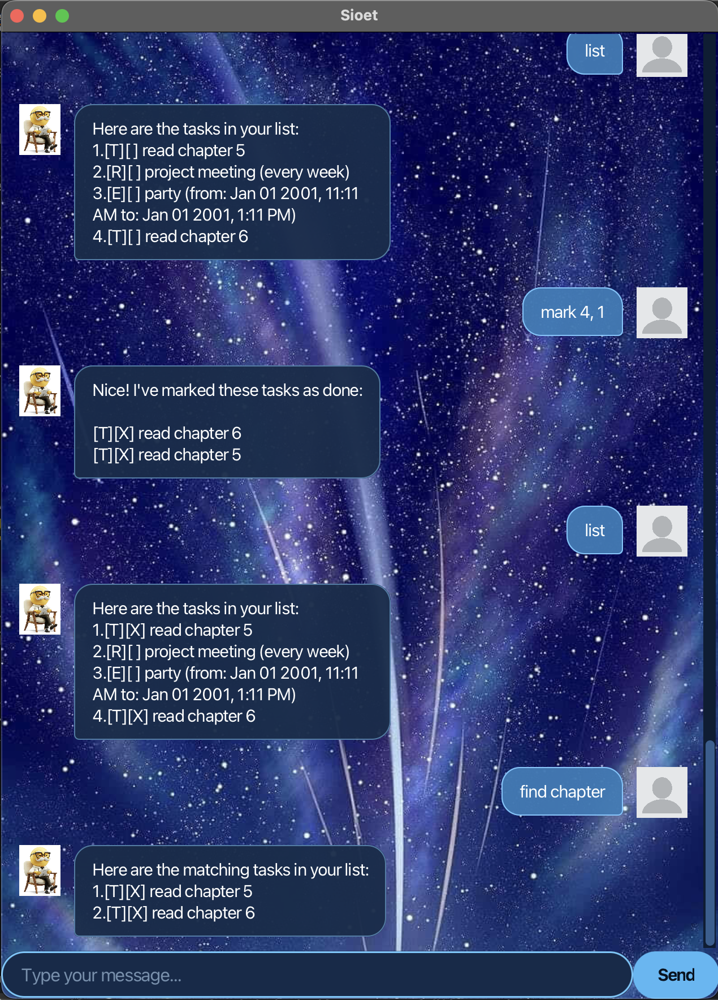

# Sioet User Guide



Sioet is a simple task manager that helps you keep track of todos, deadlines, events, and recurring tasks.

## Features

### Viewing tasks

Use `list` to display all your tasks.

**Example:**

```text
list
```

Sioet will display all tasks together with their task numbers and completion status.

### Adding a todo

Use `todo` followed by the task description to add a simple task.

**Example:**

```text
todo buy groceries
```

**Expected outcome:**

```text
Got it. I've added this task:
[T][ ] buy groceries
```

### Adding a deadline

Use `deadline` followed by the task description and a date/time.

**Format:**

```text
deadline DESCRIPTION /by DATE TIME
```

**Example:**

```text
deadline submit report /by 25/9/2026 2359
```

The deadline will be added to your task list with the specified date and time.

### Adding an event

Use `event` followed by the event description, starting date/time, and ending date/time.

**Format:**

```text
event DESCRIPTION /from DATE TIME /to DATE TIME
```

**Example:**

```text
event project meeting /from 25/9/2026 1400 /to 25/9/2026 1600
```

The event will be added to your task list with its start and end times.

### Adding a recurring task

Use `repeat` to add a task that repeats at a fixed interval.

**Format:**

```text
repeat DESCRIPTION /INTERVAL
```

The supported intervals are `day`, `week`, and `month`.

**Example:**

```text
repeat project meeting /week
```

The recurring task will be displayed as:

```text
[R][ ] project meeting (every week)
```

### Marking a task as done

Use `mark` followed by the task number to mark a task as completed.

**Example:**

```text
mark 1
```

The task will be shown as completed.

### Unmarking a task

Use `unmark` followed by the task number to mark a completed task as incomplete again.

**Example:**

```text
unmark 1
```

### Finding tasks

Use `find` followed by a keyword to search for tasks containing that keyword.

**Example:**

```text
find meeting
```

Sioet will display the tasks whose descriptions contain `meeting`.

### Exiting Sioet

Use `bye` to exit the application.

**Example:**

```text
bye
```

Sioet will save your tasks before exiting.

## Date and time format

For deadlines and events, enter dates and times in the following format:

```text
d/M/yyyy HHmm
```

For example:

```text
25/9/2026 1400
```

## Notes

* Task numbers are shown when you list your tasks.
* Use the task number with `mark` or `unmark`.
* Recurring tasks support `day`, `week`, and `month`.
* Your tasks are saved automatically when changes are made.

